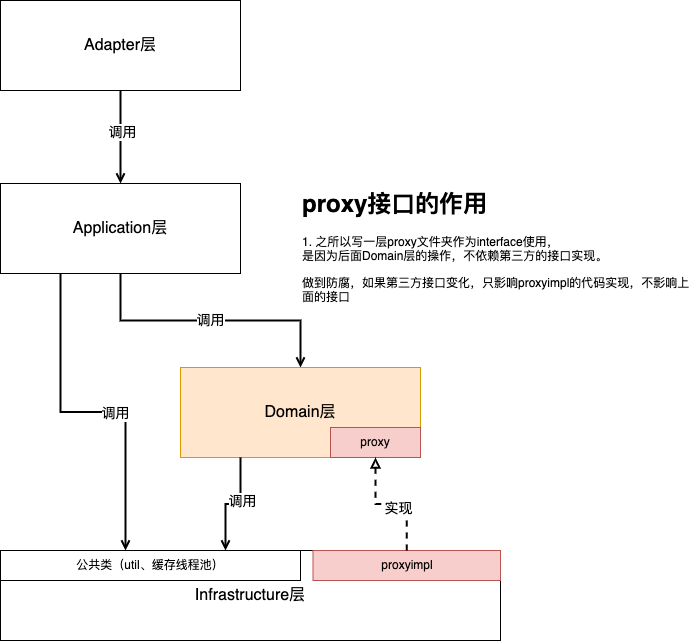

# ddd-one-module-style
this is one module ddd style project demo, as a scaffold project

# 1 项目的职责

作为内容审核的入口层核心服务，为算法服务包装api接口，并且提供简单的文字检索逻辑，拥有控制算法使用的开关能力。

# 2 项目的目录逻辑

## 2.1 ddd的概念

DDD难以掌握的原因之一是因为其涉及很多概念，比如像Ubiquitous Language、Bounded Context、Context Mapping、Domain、Domain
Service、Repository、Aggregation root、Entity、Value Object等等。这里简要介绍一下DDD的核心概念，了解这些概念可以更好地帮助我们落地DDD。

- **适配层（Adapter Layer）**：负责对前端展示（web，wireless，wap）的路由和适配，对于传统B/S系统而言，adapter就相当于MVC中的controller；
- 应用层（Application Layer）：主要负责获取输入，组装上下文，参数校验，调用领域层做业务处理，如果需要的话，发送消息通知等。层次是开放的，应用层也可以绕过领域层，直接访问基础实施层；
- **领域层（Domain Layer）**：主要是封装了核心业务逻辑，并通过领域服务（Domain Service）和领域对象（Domain
  Entity）的方法对App层提供业务实体和业务逻辑计算。领域是应用的核心，不依赖任何其他层次；
- **基础实施层（Infrastructure Layer）**
  ：主要负责技术细节问题的处理，比如数据库的CRUD、搜索引擎、文件系统、分布式服务的RPC等。此外，领域防腐的重任也落在这里，外部依赖需要通过proxy的转义处理，才能被上面的App层和Domain层使用。
  包结构分层

| 层次                                                                          | 包名                                                                                                         | 功能                                                                                                                                            | 必选    |
|-----------------------------------------------------------------------------|------------------------------------------------------------------------------------------------------------|-----------------------------------------------------------------------------------------------------------------------------------------------|-------|
| [adapter](src%2Fmain%2Fjava%2Fcom%2Fddd%2Fexample%2Fadapter)                | [controller](src%2Fmain%2Fjava%2Fcom%2Fddd%2Fexample%2Fadapter%2Fcontroller)                               | 处理页面请求的Controller，或者外部数据请求的，主要做参数校验和数据结果封装，前端适配，核心逻辑放在domain层                                                                                 | 否     |
| [adapter](src%2Fmain%2Fjava%2Fcom%2Fddd%2Fexample%2Fadapter)                | [cmd](src%2Fmain%2Fjava%2Fcom%2Fddd%2Fexample%2Fadapter%2Fcontroller%2Fcmd)                                | 外部Controller请求中的写请求command，包含创建、更新、删除等请求参数（从请求层面做读写分离CQRS架构）                                                                                  | 否     |
| [adapter](src%2Fmain%2Fjava%2Fcom%2Fddd%2Fexample%2Fadapter)                | [query](src%2Fmain%2Fjava%2Fcom%2Fddd%2Fexample%2Fadapter%2Fcontroller%2Fquery)                            | 外部Controller请求中的读请求query，查询参数（从请求层面做读写分离CQRS架构）                                                                                               | 否     |
| [application](src%2Fmain%2Fjava%2Fcom%2Fddd%2Fexample%2Fapplication)        | [user](src%2Fmain%2Fjava%2Fcom%2Fddd%2Fexample%2Fapplication%2Fuser)                                       | mvc架构中的service层的业务逻辑                                                                                                                          | 是     |
| [application](src%2Fmain%2Fjava%2Fcom%2Fddd%2Fexample%2Fapplication)        | [consumer](src%2Fmain%2Fjava%2Fcom%2Fddd%2Fexample%2Fapplication%2Fconsumer)                               | 处理外部message（消息队列）                                                                                                                             | 否     |
| [application](src%2Fmain%2Fjava%2Fcom%2Fddd%2Fexample%2Fapplication)        | [scheduler](src%2Fmain%2Fjava%2Fcom%2Fddd%2Fexample%2Fapplication%2Fscheduler)                             | 处理定时任务 场景                                                                                                                                     | 否     |
| [domain](src%2Fmain%2Fjava%2Fcom%2Fddd%2Fexample%2Fdomain)                  | [user](src%2Fmain%2Fjava%2Fcom%2Fddd%2Fexample%2Fdomain%2Fuser)这个user只是一个示例，其他领域可以更具 业务自定义，就是语文上讲的归纳总结出的名词 | 事务操作只能放在这一层，按照具体的领域实现，例如用户领域包user，里面包含多个包 valueobject(值对象，就是本层使用的枚举)，entity（实体-领域对象）、service（领域服务，可以包装数据库的服务，例如父子表统一查询对完吐出公共的领域对象）、repository | **否** |
| [domain](src%2Fmain%2Fjava%2Fcom%2Fddd%2Fexample%2Fdomain)                  | [proxy](src%2Fmain%2Fjava%2Fcom%2Fddd%2Fexample%2Fdomain%2Fproxy)                                          | 第三方api接口的代理接口定义（用于做第三方接口防腐层）第三方接口代理（防腐层），第三方的dto 和 dto的转换器                                                                                    | **是** |
| [infrastructure](src%2Fmain%2Fjava%2Fcom%2Fddd%2Fexample%2Finfrastructure)  | [proxyimpl](src%2Fmain%2Fjava%2Fcom%2Fddd%2Fexample%2Finfrastructure%2Fproxyimpl)                          | 第三方api接口的代理接口定义的实现                                                                                                                            | 是     |
| [infrastructure](src%2Fmain%2Fjava%2Fcom%2Fddd%2Fexample%2Finfrastructure)  | [config](src%2Fmain%2Fjava%2Fcom%2Fddd%2Fexample%2Finfrastructure%2Fconfig)                                | 配置信息                                                                                                                                          | 否     |
| [infrastructure](src%2Fmain%2Fjava%2Fcom%2Fddd%2Fexample%2Finfrastructure)  | [dao](src%2Fmain%2Fjava%2Fcom%2Fddd%2Fexample%2Finfrastructure%2Fdao)                                      | ibatis数据库映射                                                                                                                                   | 否     |

服务的调用的层次关系如下图



## 2.2 BO VO DTO的使用逻辑

**BO（Business Object）** 是业务对象，承载业务层的数据封装和处理，所以在Application层的应用数据，如果需要承载，写成XXBo，详见：[bo](src%2Fmain%2Fjava%2Fcom%2Fctyun%2Fcontext%2Fguard%2Fdog%2Fapplication%2Fimagehandle%2Fbo)中的 UseInfoBo这种定义。


# 3 dao层的规则

dao层的mybatis文件使用mybatis-plus，但是自定义的sql文件写在src/main/resources/mapper
中的XxxMapper.xml中，而不是写在代码中，将sql和工程代码解耦合

# 4 线程池的使用
使用带有trace处理的线程池，配置位置[ThreadPoolConfig.java](src%2Fmain%2Fjava%2Fcom%2Fctyun%2Fcontext%2Fguard%2Fdog%2Finfrastructure%2Fconfig%2FThreadPoolConfig.java)中
主题配置在[application.yml](src%2Fmain%2Fresources%2Fapplication.yml)中后面使用k8s的configMap动态调整


使用方式

```java
import org.springframework.beans.factory.annotation.Autowired;

@Autowired
ExecutorService traceThreadPool;

public void test() {
//简单的提交一个异步线程
    traceThreadPool.submit(() -> {
        //业务逻辑
    });
}
```


# 5 接口文档编写

## 5.1 使用swagger3的接口文档编写规则

| 注解名            | 使用方式                                                                 |
|-------------------|--------------------------------------------------------------------------|
| `@Operation`      | 在方法上使用，用于描述 API 操作的信息，如摘要、描述、标签等。                |
| `@ApiResponse`    | 在 `@Operation` 注解中使用，定义 API 响应的状态码、描述和响应内容的数据模型。 |
| `@ApiResponses`   | 在方法上使用，包含多个 `@ApiResponse` 注解，用于定义不同响应状态下的响应信息。 |
| `@Parameter`      | 在方法参数上使用，用于描述参数的详细信息，如名称、位置、类型、是否必需等。    |
| `@Parameters`     | 在方法上使用，包含多个 `@Parameter` 注解，用于定义多个方法参数。             |
| `@RequestBody`    | 在方法参数上使用，用于描述请求体的内容和数据模型。                          |
| `@Schema`         | 在实体类字段上使用，用于描述数据模型的详细信息，如名称、类型、描述、示例值等。 |
| `@Tags`           | 在控制器类上使用，用于指定多个标签，覆盖默认生成的类名标签。                   |
| `@Tag`            | 在控制器类或方法上使用，用于定义单个标签的名称和描述。                       |
| `@Hidden`         | 在控制器类或方法上使用，用于隐藏 API 文档中的指定控制器或方法。               |

Swagger3.0对比Swagger2.0的注解变化

@ApiImplicitParam：在 Swagger 2.0 中用于描述单个请求参数详细信息，Swagger 3.0 中已经启用了 @Parameter 来取代 @ApiImplicitParam。
@ApiImplicitParams：在 Swagger 2.0 中被用来描述多个请求参数详细信息，Swagger 3.0 中已经不再使用。
@ApiModel：在 Swagger 2.0 中是用于描述数据模型的元素，Swagger 3.0 中已经废弃了，取而代之的是 @Schema。
@ApiModelPropery：在 Swagger 2.0 中是用于描述模型属性信息的注解，Swagger 3.0 中已经废弃了，取而代之的是@Schema。
@ApiError：在 Swagger 2.0 中用于描述错误响应信息，Swagger 3.0 中已经废弃了，取而代之的是 @ApiResponse。
@ApiIgnore：在 Swagger 2.0 中用于忽略某个 API 接口，Swagger 3.0 中已经废弃了，取而代之的是 @Operation(hidden=true)。


## 5.2 接口编写示例
controller示例

```java

@Tag(name = "等级接口分组", description = "等级相关接口api")
@RestController
@RequestMapping("/grade")
public class GradeController {

  @Autowired
  private IGradeService gradeService;

  /**
   * 新增规则
   * @param requestDTO
   * @return
   */
  @Operation(tags = "等级接口分组", description = "新增规则")
  @PostMapping("/rule/create")
  public WebResult createRule(@RequestBody @Valid RuleGradeCreateRequestDTO requestDTO) {
    return gradeService.createRule(requestDTO);
  }
}
```
dto示例
入参/出参对象添加注解@Schema(description = "请求入参的描述"))
```java
 
@Schema(description = "请求入参")
@Data
public class RuleGradeCreateRequestDTO  extends BaseDTO {
 
 
    @Schema(description = "等级设置不能为空", required = true)
    @NotNull(message = "等级设置不能为空")
    private List<RuleGradeCreateDetailRequestDTO > detailRequestDTOList;
 
    @Schema(description = "等级数量不能为空", required = true)
    @NotNull(message = "等级数量不能为空")
    private Integer gradeNum;
 
    @Schema
    @Data
    public static class RuleGradeCreateDetailRequestDTO  {
        @Schema(description = "等级设置不能为空", required = true)
        @NotNull(message = "等级设置不能为空")
        private String gradeName;
 
        @Schema(description = "得分率不能为空", required = true)
        @NotNull(message = "得分率不能为空")
        @Max(value = 100)
        @Min(value = 0)
        private Integer gradeRate;
    }
}
```
出参
```java
@Schema
@Data
public class GradeSearchResponseDTO extends BaseDTO {
 
    @Schema(description = "主键id", required = true)
    private String id;
  
    @Schema(description = "等级设置", required = true)
    private List<GradeSearchDetailResponseDTO> detailResponseDTOList;
 
    @Schema(description = "等级数量",required = true)
    private Integer gradeNum;
 
    @Data
    public static class GradeSearchDetailResponseDTO {
        @Schema(description = "等级名称", required = true)
        private String gradeName;
 
        @Schema(description = "得分率", required = true)
        private Integer gradeRate;
    }
}
```

## 5.3 Swagger3 UI 地址

```http
http://localhost:8410/swagger-ui/index.html#/
```

# 6 本地加载yaml
运行程序配置
```
Active profiles: local
```
# 7 分支规范
详见：

# 8 配置管理

线上k8s上的测试服务配置
- deployment.yaml文件是 [deployment.yaml](deployment%2Fdeployment.yaml)
- service.yaml文件是[service.yaml](deployment%2Fservice.yaml)
- configmap.yaml文件是[configmap-env.yaml](deployment%2Fconfigmap-env.yaml)
- secret.yaml文件是[secret-env.yaml](deployment%2Fsecret-env.yaml)


# 9 上线的sql管理
位置：[db](deployment%2Fdb)[db](deployment%2Fdb)
规则：
redo 要执行的SQL，undo 要回滚的SQL，双划线(__)是迭代和描述分隔符
redo_s24__20240701_001_init.sql
undo_s24__20240701_001_init.sql

# 10 其他服务的访问本服务的方式
k8s集群内的服务访问本服务，集群内访问方式：
`{serviceName}.{namespace}.svc.cluster.local:{port}/请求路径`

# 11 本地启动测试
本地测试部署方式：
1. k8s上port forward mysql、redis节点到本地端口 （和服务端口一致）
2. 启动本服务

#12 远程debug
1. k8s上port forward service中的8418端口到本地端口（和服务启动的debug端口一致）用于remote方式debug
2. 通过远程debug的方式快速调试代码


