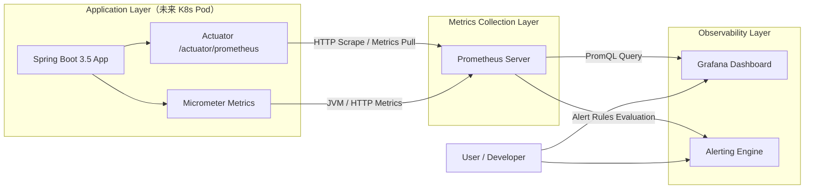

# 配置springboot3.x 的Prometheus和Grafana看板

流程图：

Spring Boot（Micrometer）
        ↓
Prometheus（拉取 metrics）
        ↓
Grafana（可视化 + PromQL）
        ↓
Alerting（流量下降 / JVM异常）





## 1 首先配置springboot3.x 的actuator监控

基础路径：`/actuator`

完整地址：`http://localhost:8080/actuator`（默认端口 8080）

常用端点示例：

- 健康检查：`/actuator/health`
- 应用信息：`/actuator/info`
- 环境变量：`/actuator/env`

springboot的yaml配置

```yaml
# 监控点配置
management:
  endpoints:
    web:
      exposure:
        include: prometheus,health,info  # 所有的都监控
  endpoint:
    prometheus:
      enabled: true
```

> 如果想做到独立的端口配置监控信息，可以另开一个，这里以properties文件举例，可以是yaml的，独立端口是9090，请求的路径也可以修改成9090，同时prometheus监控的端口改为9090
>
> ```properties
> 
> # 主服务配置
> server.port=8080
> server.servlet.context-path=/demo
> 
> # Actuator配置
> management.server.port=9090
> management.server.address=127.0.0.1
> management.endpoints.web.base-path=/manage
> management.endpoints.web.exposure.include=health,info,env,metrics
> ```

如果是k8s主动获取用户注册 `Service + Pod annotation`  通过service的端口监听pod的信息

方法一：最好做成javaagent的形式开放端口，

方法二：就是k8s的deployment的配置中annotition配置监听端口，deployment的配置代码如下

```yaml
annotations:
  prometheus.io/scrape: "true"
  prometheus.io/path: "/actuator/prometheus"
  prometheus.io/port: "8080"
```


## 2 Prometheus的配置

监控metrics_path就是监控的路径 因为没修改独立的路径，所以使用 /actuator/prometheus

```yaml
global:
  scrape_interval: 5s

scrape_configs:
  - job_name: 'springboot-app'
    metrics_path: '/actuator/prometheus'
    static_configs:
      - targets: ['host.docker.internal:8080']

# host.docker.internal 用于访问你本机 IDEA 启动的服务
# K8s 里这里会换成 Service 名
```

## 3 使用grafana的配置

监控 http://prometheus:9090，配置详见[datasource.yml](grafana%2Fprovisioning%2Fdatasources%2Fdatasource.yml)

## 4 进行docker-compose的设置
详见：[docker-compose.yml](docker-compose.yml)， grafana依赖(depends_on)prometheus，两者通过monitor-net 桥接

## 5 启动验证各环节配置

### 5.1 springboot环节验证

打开网页http://localhost:8080/actuator/prometheus  返回jvm_memory_used_bytes数据，证明spring环节ok

> [!NOTE]
>
> 因为springboot2.x和springboot3.x 的监控参数不一致，2是jvm_memory_used 而3 是jvm_memory_used_bytes会导致使用grafana的配置模版失效，原有的ID 8878 and ID 4701的dashboard会失效

### 5.2 prometheus的数据验证

进入http://localhost:9090/targets endpoint显示数据的status是up的状态就是ok了

### 5.3 Grafana的dashboard配置

登录输入docker-compose设置的密码

1. 配置Connections添加数据源   左侧菜单 → **Connections → Data sources → Add data source**
   1. 连接url地址选择

      - docker部署的地址connection选择http://host.docker.internal:9090

      -  如果是注册服务的地址http://{k8s的service}:{service的port}

   2. 滑到最下面 → **Save & test**

      显示 `Data source is working` 就成功。

2. 配置监控看盘

   使用springboot3的监控看盘 id选择 左侧菜单→ **Dashboards → New → Import**

   选择已有的模版可以是22108，说明在：https://grafana.com/grafana/dashboards/22108-jvm-springboot3-dashboard-for-prometheus-operator/

   如果自己配置需要依照springboot 3.5.0的监控项配置http://localhost:8080/actuator/prometheus，使用json，参考下载下来的[22108_rev3的模版.json](doc%2F22108_rev3%E7%9A%84%E6%A8%A1%E7%89%88.json)


## 6 docker的部署与删除

在服务的根目录操作

```bash
 cd monitoring && docker compose up -d
```

如果需要删除重建使用，

```bash
docker compose down -v && docker compose up -d
```
